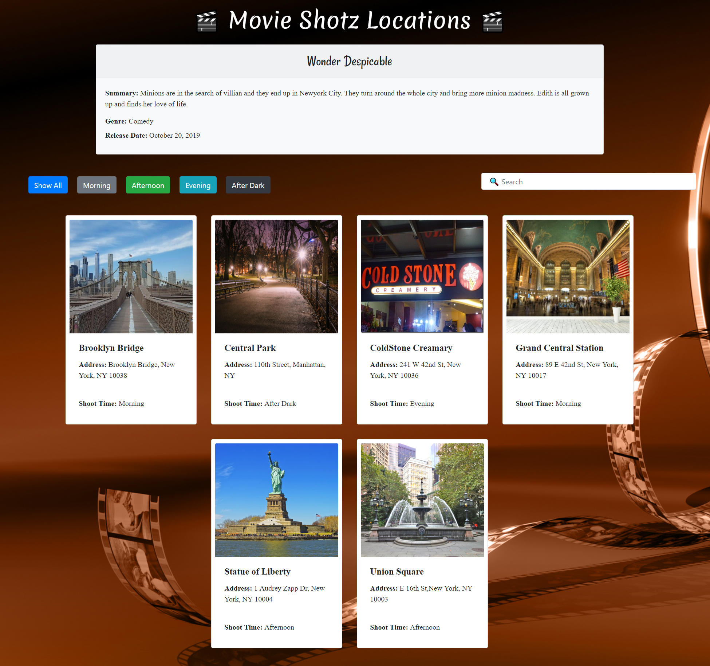

## The Shotz: Part 1
I want to keep track of all the shooting locations for my soon to be oscar winning movie. Upon arriving at the homepage, I should see a section with information on my movie and I will see a list of all locations that I plan to shoot, displayed as cards. As a user, I should be displayed a search bar. This search bar should filter the results of the cards. On keypress, the text I type in the search bar should be contained in either the location title text or the location address of all cards still displayed. Also, I should see 5 buttons: All, Morning, Afternoon, Evening, After Dark. These buttons should filter the results down to each location that has a "Shoot Time" corresponding to the button clicked.

## Screenshots
1. Initial Page


## How to run this project
* Use npm to install http-server in your terminal:
```
npm install -g http-server
```
* Run the server
```
hs -p 9091
```
* Open chrome and navigate to :
```
localhost:9091
```