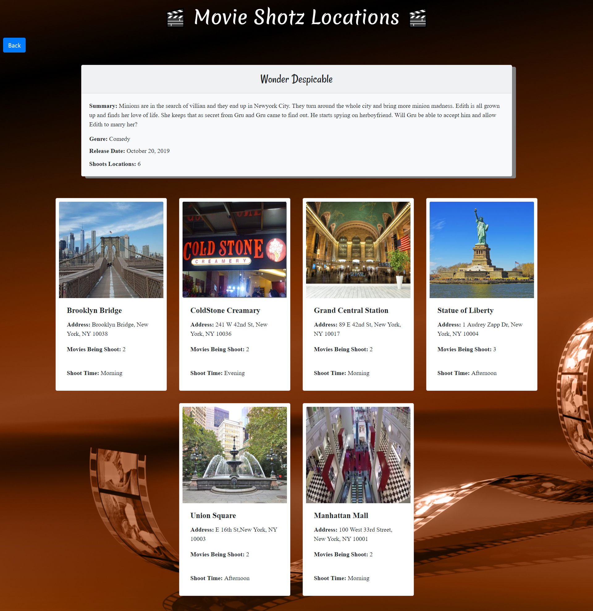
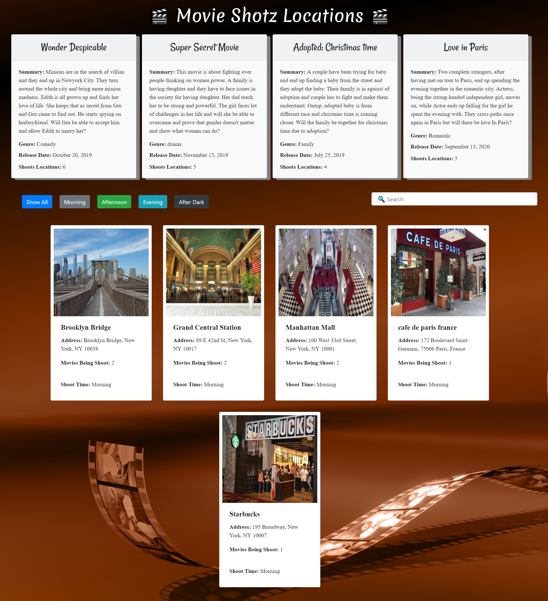
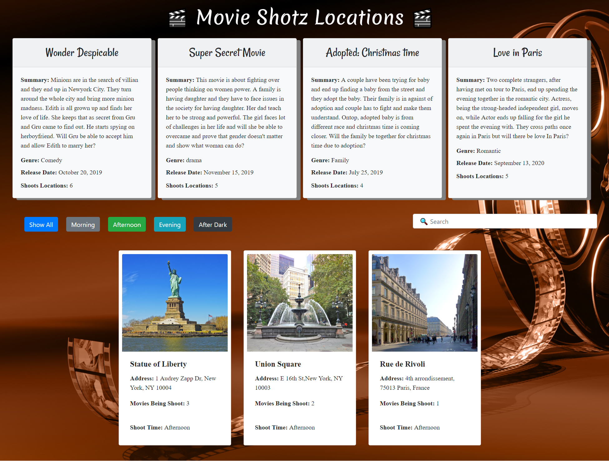
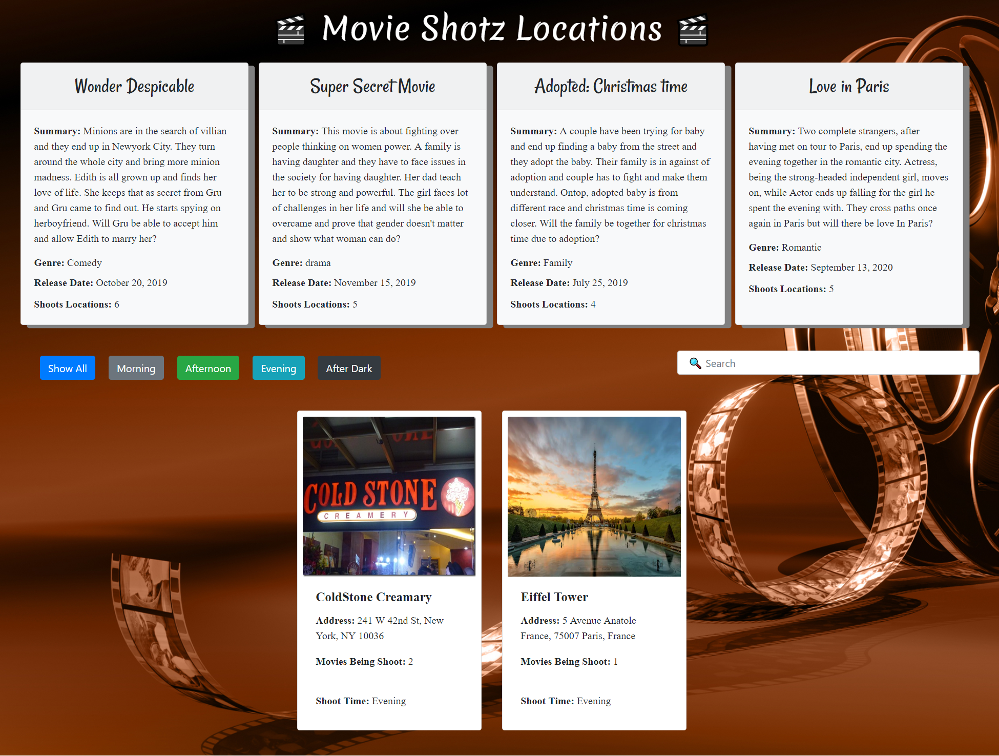
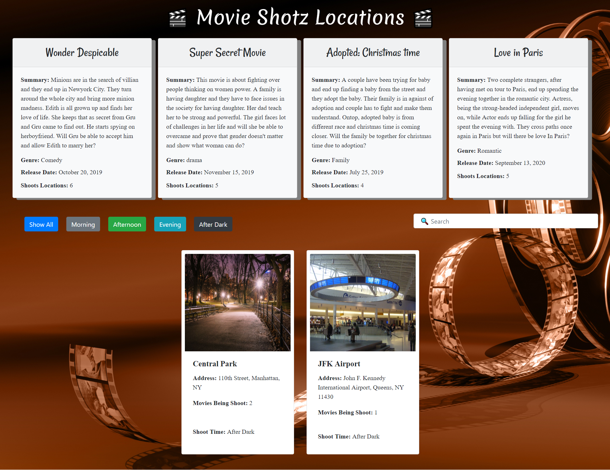

## The Shotz: Part 1
I want to keep track of all the shooting locations for my soon to be oscar winning movie. Upon arriving at the homepage, I should see a section with information on my movie and I will see a list of all locations that I plan to shoot, displayed as cards. As a user, I should be displayed a search bar. This search bar should filter the results of the cards. On keypress, the text I type in the search bar should be contained in either the location title text or the location address of all cards still displayed. Also, I should see 5 buttons: All, Morning, Afternoon, Evening, After Dark. These buttons should filter the results down to each location that has a "Shoot Time" corresponding to the button clicked.

### Single Location View:
As a user, when I click on one of the movie cards, the DOM is completely rewritten (as though I am on a new page). This new DOM should have the info for the single movie I clicked on, cards for the locations for the movie I am currently viewing, and a back button.
If I click on the back button, I should then be viewing "All Locations/movies View"

## Technical Requirements
- Use of promises.
- Use of Bootstrap.
- Use of jQuery for
    * DOM manipulation
    * Event listeners
    * Selecting elements from  the DOM Traversal
    * Filtering results
    * AJAX call to the json file of locations

## Screenshots
1. Initial Page


2. Single Movie and associated Locations View



3. Click on Morning Button View



4. Click on Afternoon View



5. Click on Evening View



6. Click on After Dark View




## How to run this project
* Use npm to install http-server in your terminal:
```
npm install -g http-server
```
* Run the server
```
hs -p 9091
```
* Open chrome and navigate to :
```
localhost:9091
```